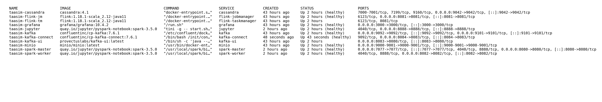

# TaaSim Casablanca: Transport as a Service — Simulation



TaaSim (Transport as a Service – Simulation) is an intelligent, data-driven urban mobility platform designed for Casablanca. It treats urban transit as a real-time big data challenge by connecting riders and vehicles dynamically, predicting demand surges, and providing unified analytics for city planners.

This project was developed as the Final Capstone Project for the Advanced Big Data program at the National School of Applied Sciences — Al Hoceima (ENSAH), 2025–2026.

## 👥 Team
- **Mohamed Tamzirt** (Data Engineering Lead)
- **Salma Said** (ML & Platform Lead)
- **Supervised by:** Prof. Mohamed El Marouani

---

## 🏗️ Architecture Overview

TaaSim utilizes a **Kappa Architecture**, streamlining both real-time streaming and historical batch workflows through a unified messaging backbone. 

### The Technology Stack
* **Messaging:** Apache Kafka (KRaft mode) — Central event bus for GPS pings and trip reservations.
* **Streaming Engine:** Apache Flink — Real-time event time processing, stateful trip matching, and demand aggregations.
* **Batch & ML Engine:** Apache Spark (PySpark & MLlib) — Offline ETL, large-scale dataset remapping, and Gradient Boosted Trees (GBT) demand forecasting.
* **Object Storage:** MinIO (S3 Compatible) — Distributed data lake containing raw, curated, and ML artifact zones.
* **Low-Latency Database:** Apache Cassandra — Optimized, partition-aligned NoSQL serving layer for APIs and dashboards.
* **API Backend:** FastAPI — Secure, JWT-authenticated REST interface for riders and admins.
* **Visualization:** Grafana — Live map monitoring, demand heatmaps, and KPI dashboards.

---

## 🚀 Getting Started

### Prerequisites
* **Docker & Docker Compose** (Ensure Docker Engine is running)
* **Memory Limit:** Minimum **8 GB RAM** allocated to Docker (12 GB recommended to support Flink, Spark, and Cassandra simultaneously).
* **Python 3.10+** (if running client scripts locally outside of containers).

### 1. Bring Up the Infrastructure
Start the entire 12-container data stack via Docker Compose:

```bash
# Start all core services in detached mode
docker compose up -d
```

Ensure all services are running and healthy:
```bash
docker compose ps
```

### 2. Initialize Datasets
Before running the simulation, verify that the required datasets are mounted or downloaded to the `raw/` directory:
- `raw/porto-trips/train.csv` (Used for generating simulated Casablanca trips)
- *Note: Do not commit these large datasets to version control.*

### 3. Start the Simulation Producers
Once the stack is healthy, start the Python simulators to inject real-time GPS pings and ride reservations into Kafka:

```bash
# Create a virtual environment (optional but recommended)
python3 -m venv venv
source venv/bin/activate
pip install -r requirements.txt

# Start GPS vehicle simulator
python src/producers/vehicle_gps_producer.py --speed 10

# In a separate terminal, start Rider trip request simulator
python src/producers/trip_request_producer.py --speed 10
```

---

## ⚡ Batch Processing & Machine Learning

Batch ETL pipelines and ML training are executed via Apache Spark. The Spark cluster connects directly to MinIO via the S3A filesystem connector.

To run the pipelines:

```bash
# 1. Run the ETL process (cleans and projects Porto coordinates to Casablanca)
docker exec -it spark-master spark-submit /home/jovyan/spark_jobs/etl_porto.py

# 2. Run the Machine Learning Demand Forecaster
docker exec -it spark-master spark-submit /home/jovyan/spark_jobs/ml_model_training.py

# 3. Compute Weekly KPIs
docker exec -it spark-master spark-submit /home/jovyan/spark_jobs/kpi_weekly.py
```

---

## 📡 API & Dashboards

### FastAPI Endpoints
The REST API serves the mobile application layer and the predictive ML endpoints. It runs locally on port `8000`. 
* **Swagger UI / Documentation:** `http://localhost:8000/docs`
* *Security Note:* Protected endpoints require a JWT Bearer token obtained via `/auth/token`.

### Grafana Dashboard
Access the live operational dashboard directly:
* **URL:** `http://localhost:3000`
* **Credentials:** `admin` / `admin` (or as configured in `.env`).
* Contains live vehicle geomaps, demand heatmaps, and SLA performance KPIs.

---

## 🧪 Testing & Validation

The project includes an extensive test suite verifying data anonymization, stateful checkpointing, and Service Level Agreements (SLAs).

Run the automated test suite:
```bash
# Verify that no raw GPS coordinates are leaked into Cassandra
python tests/test_gps_anonymization.py

# Verify Flink checkpoint recovery during chaos testing
./tests/test_checkpoint_recovery.sh
```

**SLA Achievements:**
* **Trip Matching Latency:** < 0.5s P95
* **GPS Freshness:** < 1.5s
* **ML API Forecast Response:** < 50ms

---

## 📖 Documentation
For deeper dives into the system design, architecture decision records (ADRs), and sprint progress, refer to the `docs/` directory:
* [Technical Report](docs/technical-report.md)
* [Pitch Deck](docs/pitch-deck.md)
* [Team & Concept](docs/team-concept.md)

---
*TaaSim Casablanca — Bringing data-driven mobility to Morocco, one zone at a time.*
