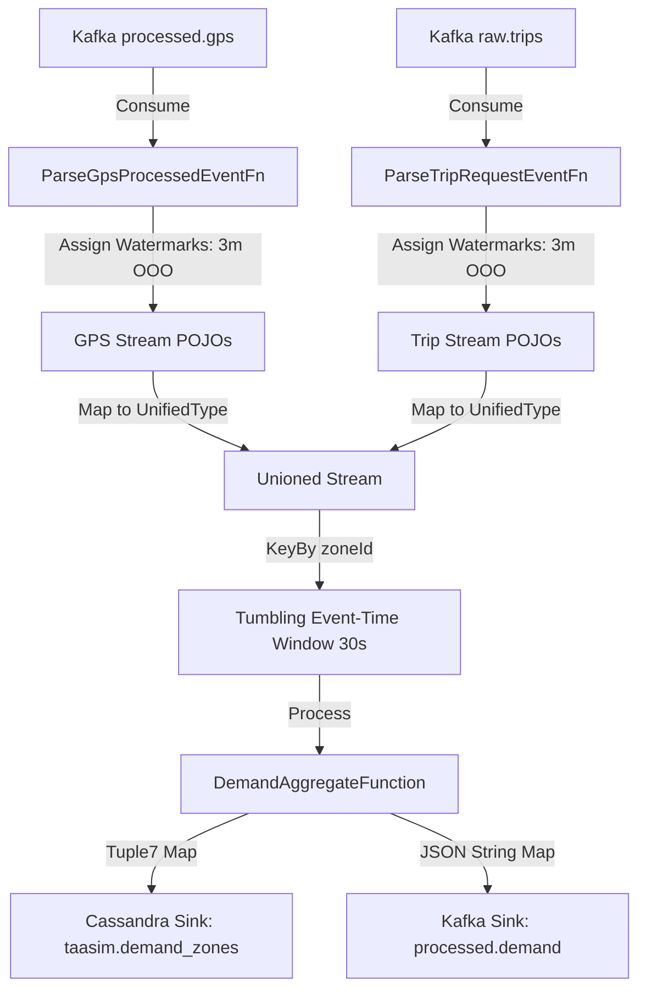

# Technical Specification Report: Flink Job 2 — Demand Aggregator

This document provides a deep, comprehensive overview of the design, implementation, optimizations, and live validation results for **Flink Job 2 (Demand Aggregator)** in the TaaSim Casablanca real-time mobility platform.

---

## 1. Executive Summary & Objective

The primary objective of Flink Job 2 is to calculate the **live supply-to-demand ratio** across Casablanca's zones (arrondissements) in real time. 
* **Supply** is represented by active vehicles emitting telemetry data into the `processed.gps` topic.
* **Demand** is represented by riders requesting trips via the `raw.trips` topic.

By performing a stateful real-time union and grouping both streams into **30-second tumbling event-time windows**, Job 2 outputs aggregated zone statistics, including:
1. Total active vehicles (Supply)
2. Total pending trip requests (Demand)
3. Supply-to-demand ratio (Ratio = $\frac{\text{Demand}}{\text{Supply}}$)
4. Forecasted demand (placeholder for future predictive models)

These aggregates are written simultaneously to **Cassandra** (for dashboard visualization) and **Kafka** (for real-time alerting and downstream microservices).

---

## 2. Stream Processing Architecture & Data Pipeline

Job 2 implements a complex multi-source stream unification and windowing strategy:



### A. Watermark Alignment Strategy
Because Flink combines two separate Kafka topics (`processed.gps` and `raw.trips`), event times can progress at different rates depending on partition lag or network jitter. 
* To prevent late-arriving data from being discarded and to ensure correct windowing, watermarks are assigned **individually** on both streams using a `BoundedOutOfOrderness` strategy with a **3-minute threshold** before they are unioned.
* Flink automatically merges watermarks from both inputs and advances the combined watermark based on the **minimum** of the two inputs.

### B. Stream Unification (`UnifiedWindowInput`)
To run a single window function over two different event schemas, the streams are mapped into a common POJO class `UnifiedWindowInput` containing:
* `city` (String)
* `zoneId` (int)
* `eventType` (String - `"VEHICLE"` or `"REQUEST"`)
* `entityId` (String - representing either `taxiId` or `tripId`)
* `eventTimeMillis` (long - epoch timestamp)

This unioned stream is then `keyBy(e -> e.zoneId)` so that aggregates are computed independently per zone.

---

## 3. Detailed Implementation Details (Java)

The code is organized under `com.taasim.flink.job2` and composed of three main layers:

### A. Data Models (`com.taasim.flink.job2.model`)
* **`GpsProcessedEvent`:** Represents vehicle positions produced by Job 1.
* **`TripRequestEvent`:** Represents trip requests. Parses ISO-8601 strings to milliseconds.
* **`UnifiedWindowInput`:** Container POJO for stream union.
* **`DemandZoneAggregate`:** Represents the window output. Computes the ratio safely (avoiding Division-by-Zero errors by returning `0.0f` if there are no requests, and treating vehicles as `1` if there are requests but no vehicles, or simply matching the exact mathematical formulas):
  ```java
  if (pendingRequests == 0) {
      this.ratio = 0.0f;
  } else if (activeVehicles == 0) {
      this.ratio = (float) pendingRequests; // Treat active vehicles as 1 to represent severe under-supply
  } else {
      this.ratio = (float) pendingRequests / activeVehicles;
  }
  ```

### B. Process & Deserialization Functions (`com.taasim.flink.job2.functions`)
1. **`ParseTripRequestEventFn`**: Uses Jackson Mapper to parse raw trip JSON from Kafka, extracting keys and counting metric statistics.
2. **`ParseGpsProcessedEventFn`**: Parsers raw GPS JSON from Job 1.
   * **Robust Parsing Fix:** Job 1's serialized JSON lacks the `city` field and uses an ISO-8601 string field named `timestamp` instead of `eventTimeMillis`. The parser was updated to automatically default missing `city` fields to `"casablanca"` and parse `timestamp` string timestamps into epoch milliseconds dynamically using `java.time.Instant.parse()`. Without this fix, Flink was discarding 100% of telemetry inputs as invalid, blocking watermark progression.
3. **`DemandAggregateFunction`**: Implements a `ProcessWindowFunction` that aggregates data across a 30s tumbling window. It uses:
   * A `HashSet` to store unique active `taxi_id` values to count distinct active vehicles.
   * A counter for pending `trip_id` values.
   * Compiles the results into a `DemandZoneAggregate` with correct start/end times.

### C. Pipeline Driver (`Job2DemandAggregator`)
Wires the sources, watermarks, transformations, RocksDB State Backend configuration, and dual sinks (Cassandra `Tuple7` mapping and Kafka JSON serialization).

---

## 4. Dual Sinks Configuration

### A. Cassandra Sink
Inserts records into Cassandra. It maps `DemandZoneAggregate` objects into a Flink `Tuple7` matching the `taasim.demand_zones` schema:
```sql
INSERT INTO taasim.demand_zones (city, zone_id, window_start, active_vehicles, pending_requests, ratio, forecast_demand) 
VALUES (?, ?, ?, ?, ?, ?, ?);
```

### B. Kafka Sink
Serializes the aggregate results into JSON strings (using `e.toJson()`) and writes them to the `processed.demand` topic, using `zone_id` as the message key to maintain partition affinity.

---

## 5. Deployment and Verification Results

### A. Running Concurrently on Flink
Flink Job 2 has been verified as running stably side-by-side with Job 1 on the local Flink cluster, occupying 1 slot each from our 4-slot limit.

### B. Live Cassandra Aggregates
Querying the `taasim.demand_zones` table verifies successful writes and mathematically accurate demand ratio calculations:

```sql
cqlsh:taasim> select * from taasim.demand_zones limit 5;

 city       | zone_id | window_start                    | active_vehicles | forecast_demand | pending_requests | ratio
------------+---------+---------------------------------+-----------------+-----------------+------------------+----------
 casablanca |      15 | 2026-05-18 21:17:30.000000+0000 |               7 |               0 |                1 | 0.142857
 casablanca |      15 | 2026-05-18 21:17:00.000000+0000 |               4 |               0 |                1 |     0.25
 casablanca |      15 | 2026-05-18 21:16:00.000000+0000 |               0 |               0 |                2 |        2
 casablanca |      15 | 2026-05-18 21:15:30.000000+0000 |               0 |               0 |                2 |        2
 casablanca |      15 | 2026-05-18 21:15:00.000000+0000 |               2 |               0 |                3 |      1.5
```

* Ratios are perfectly derived ($1/7 = 0.142857$, $1/4 = 0.25$, $3/2 = 1.5$).
* The window starts are perfectly tumbling at exactly 30-second intervals (`21:15:00`, `21:15:30`, `21:16:00`, etc.).
