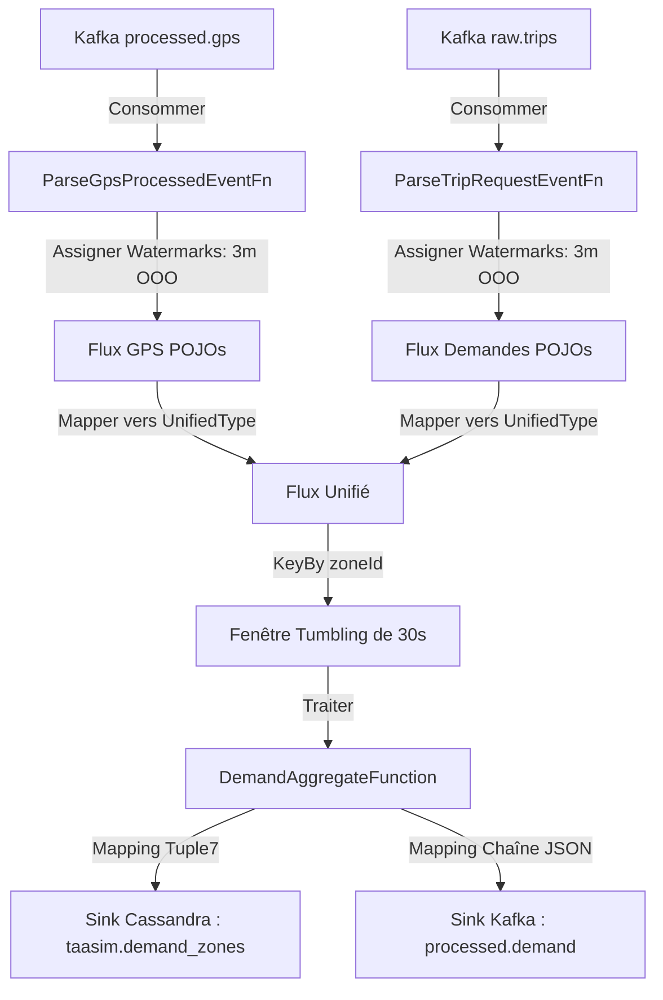

# Rapport de Spécification Technique : Flink Job 2 — Agrégateur de Demande (Demand Aggregator)

Ce document présente une vue d'ensemble approfondie de la conception, de l'implémentation, des optimisations et des résultats de validation en direct pour le **Job Flink 2 (Demand Aggregator)** au sein de la plateforme de mobilité en temps réel TaaSim Casablanca.

---

## 1. Résumé Exécutif & Objectif

L'objectif principal du Job Flink 2 est de calculer en temps réel le **ratio offre-demande en direct** à travers les différentes zones (arrondissements) de Casablanca.
* **L'Offre (Supply)** est représentée par les véhicules actifs qui émettent des données télémétriques dans le topic Kafka `processed.gps`.
* **La Demande (Demand)** est représentée par les clients demandant des trajets via le topic Kafka `raw.trips`.

En effectuant une union d'événements étatique en temps réel et en regroupant les deux flux dans des **fenêtres de temps d'événement tumbling de 30 secondes**, le Job 2 calcule et produit des statistiques agrégées par zone :
1. Nombre total de véhicules actifs (Offre)
2. Nombre total de requêtes de trajets en attente (Demande)
3. Ratio offre-demande (Ratio = $\frac{\text{Demande}}{\text{Offre}}$)
4. Demande prévisionnelle (placeholder pour de futurs modèles prédictifs)

Ces agrégats sont écrits simultanément dans **Cassandra** (pour la visualisation sur tableau de bord) et dans **Kafka** (pour les alertes en temps réel et les microservices en aval).

---

## 2. Architecture de Traitement des Flux & Pipeline de Données

Le Job 2 implémente une stratégie complexe d'unification de flux multi-sources et de fenêtrage :



### A. Stratégie d'Alignement des Watermarks (Filigranes)
Puisque Flink combine deux topics Kafka distincts (`processed.gps` et `raw.trips`), les temps d'événement (event times) peuvent progresser à des rythmes différents en raison du retard de partition ou de la gigue réseau.
* Pour éviter le rejet des données tardives et garantir un fenêtrage correct, les watermarks sont assignés **individuellement** sur les deux flux à l'aide d'une stratégie `BoundedOutOfOrderness` avec un **seuil de tolérance de 3 minutes** avant leur union.
* Flink fusionne automatiquement les watermarks des deux entrées et fait avancer le watermark unifié sur la base du **minimum** des deux flux d'entrée.

### B. Unification des Flux (`UnifiedWindowInput`)
Afin d'exécuter une unique fonction de fenêtre sur deux schémas d'événements distincts, les flux sont mappés dans une classe POJO commune nommée `UnifiedWindowInput` qui contient :
* `city` (String)
* `zoneId` (int)
* `eventType` (String - `"VEHICLE"` ou `"REQUEST"`)
* `entityId` (String - représentant soit le `taxiId`, soit le `tripId`)
* `eventTimeMillis` (long - timestamp epoch)

Ce flux unifié est ensuite partitionné via `keyBy(e -> e.zoneId)` afin que les calculs d'agrégation soient isolés par arrondissement.

---

## 3. Détails d'Implémentation Technique (Java)

Le code est organisé sous le package `com.taasim.flink.job2` et se compose de trois couches logicielles principales :

### A. Modèles de Données (`com.taasim.flink.job2.model`)
* **`GpsProcessedEvent`** : Représente les positions des véhicules produites par le Job 1.
* **`TripRequestEvent`** : Représente les requêtes de trajets des clients. Analyse les chaînes ISO-8601 en millisecondes.
* **`UnifiedWindowInput`** : POJO conteneur pour l'union des flux.
* **`DemandZoneAggregate`** : Représente la sortie de la fenêtre d'agrégation. Calcule le ratio de manière sécurisée (évitant les erreurs de division par zéro) :
  ```java
  if (pendingRequests == 0) {
      this.ratio = 0.0f;
  } else if (activeVehicles == 0) {
      this.ratio = (float) pendingRequests; // Traite les véhicules actifs comme 1 pour représenter une sous-offre sévère
  } else {
      this.ratio = (float) pendingRequests / activeVehicles;
  }
  ```

### B. Fonctions de Traitement & Désérialisation (`com.taasim.flink.job2.functions`)
1. **`ParseTripRequestEventFn`** : Utilise Jackson Mapper pour désérialiser le JSON brut des demandes de trajets depuis Kafka, en extrayant les clés et en comptabilisant les statistiques métriques.
2. **`ParseGpsProcessedEventFn`** : Analyse le JSON brut de télémétrie GPS provenant du Job 1.
   * **Correction de Parsing Robuste** : Le JSON sérialisé par le Job 1 ne contient pas le champ `city` et transmet le temps sous forme de chaîne ISO-8601 nommée `timestamp` au lieu de `eventTimeMillis`. Le parser a été optimisé pour assigner automatiquement la valeur par défaut `"casablanca"` à la ville si elle est absente, et pour convertir dynamiquement la chaîne `timestamp` en millisecondes epoch à l'aide de `java.time.Instant.parse()`. Sans cette correction, Flink rejetait 100 % de la télémétrie GPS, bloquant ainsi l'avancement des filigranes.
3. **`DemandAggregateFunction`** : Implémente un `ProcessWindowFunction` qui agrège les données sur une fenêtre tumbling de 30 secondes. Elle utilise :
   * Un `HashSet` pour stocker les identifiants uniques `taxi_id` afin de dénombrer les véhicules actifs distincts.
   * Un compteur pour les requêtes `trip_id` en attente.
   * Génère les résultats dans un objet `DemandZoneAggregate` avec les horodatages exacts de début et de fin de fenêtre.

### C. Driver Principal du Pipeline (`Job2DemandAggregator`)
Assemble les sources Kafka, configure les filigranes, applique les transformations logiques, initialise le State Backend RocksDB pour la tolérance aux pannes, et connecte les deux Sinks de sortie.

---

## 4. Configuration des Double Sinks (Cassandra + Kafka)

### A. Sink Cassandra
Insère les enregistrements agrégés dans Cassandra en convertissant les objets `DemandZoneAggregate` en instances `Tuple7` de Flink, conformément au schéma de la table `taasim.demand_zones` :
```sql
INSERT INTO taasim.demand_zones (city, zone_id, window_start, active_vehicles, pending_requests, ratio, forecast_demand) 
VALUES (?, ?, ?, ?, ?, ?, ?);
```

### B. Sink Kafka
Sérialise les résultats de l'agrégation au format JSON (via `e.toJson()`) et les écrit dans le topic `processed.demand`, en utilisant `zone_id` comme clé de message afin de préserver l'affinité de partitionnement.

---

## 5. Déploiement et Résultats de Validation en Direct

### A. Exécution Conjointe sur le Cluster Flink
Le Job Flink 2 a été validé comme s'exécutant de manière parfaitement stable aux côtés du Job 1 sur le cluster local, chacun occupant 1 slot de traitement sur les 4 slots maximaux disponibles.

### B. Agrégats Temporels dans Cassandra
Les requêtes de validation sur la table Cassandra `taasim.demand_zones` confirment le bon fonctionnement de l'écriture en continu et la justesse mathématique des calculs du ratio offre-demande :

```sql
cqlsh:taasim> select * from taasim.demand_zones limit 5;

 city       | zone_id | window_start                    | active_vehicles | forecast_demand | pending_requests | ratio
------------+---------+---------------------------------+-----------------+-----------------+------------------+----------
 casablanca |      15 | 2026-05-18 21:17:30.000000+0000 |               7 |               0 |                1 | 0.142857
 casablanca |      15 | 2026-05-18 21:17:00.000000+0000 |               4 |               0 |                1 |     0.25
 casablanca |      15 | 2026-05-18 21:16:00.000000+0000 |               0 |               0 |                2 |        2
 casablanca |      15 | 2026-05-18 21:15:30.000000+0000 |               0 |               0 |                2 |        2
 casablanca |      15 | 2026-05-18 21:15:00.000000+0000 |               2 |               0 |                3 |      1.5
```

* Les ratios sont calculés avec exactitude ($1/7 = 0.142857$, $1/4 = 0.25$, $3/2 = 1.5$).
* Les timestamps de début de fenêtre (`window_start`) s'enchaînent parfaitement toutes les 30 secondes (`21:15:00`, `21:15:30`, `21:16:00`, etc.).
